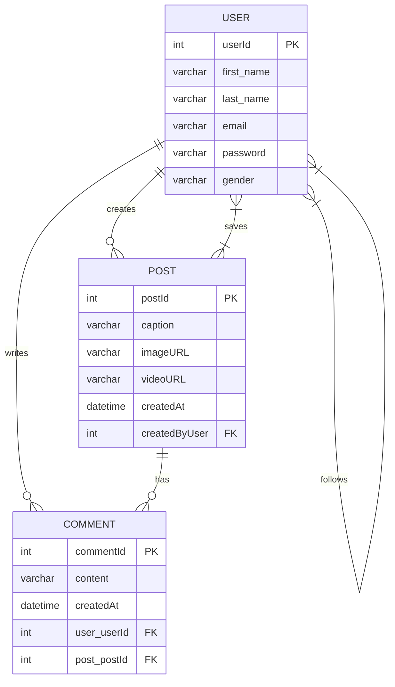

# 📱 Spring Social Media App (Backend API)


> A robust, highly optimized, and scalable RESTful backend for a Social Media Application built using **Java 17**, **Spring Boot**, and **MySQL**.  
> Designed with stateless JWT authentication, optimal database queries, and structured using Layered Architecture.

---

## 📌 Overview

This application serves as the core backend engine for a social media platform, providing:

- 👤 User Identity & Profile Management
- 📝 Post Creation & Interactions
- 💬 Real-time Commenting System
- 🗄 Robust database layer powered by Hibernate ORM
- 🔐 Secure API routing using Spring Security and JSON Web Tokens (JJWT)

The system ensures clean relational data mapping, avoids N+1 query bottlenecks, and mitigates security leaks.

---

# 🚀 Features

## 👤 User Module

- Secure JWT-Based Registration & Login
- Profile Management
- Follow & Unfollow Users
- Save / Bookmark Posts

---

## 📝 Post & Comment Module

- Create Posts with Media URLs (Images/Videos)
- Like & Unlike Posts
- Seamlessly Drop Comments on Posts
- Bi-directional relations avoiding messy join tables
- Auto-cleanup of comments when a post is deleted

---

# 🛠 Tech Stack

| Layer | Technology | Purpose |
|--------|------------|----------|
| Language | Java 17 | Core Logic |
| Framework | Spring Boot | REST API & IoC Container |
| ORM | Spring Data JPA (Hibernate) | Object Relational Mapping |
| Database | MySQL 8.0 | Persistent Storage |
| Security | Spring Security + JJWT 0.12.5 | Stateless Authentication |
| Build Tool | Maven | Dependency Management |

---

# 🗄 Database Architecture

The system utilizes an optimized relational schema designed to reduce unnecessary joins and scale efficiently.



## 📂 Project Structure

```bash
SpringSocialMediaApp/
│
├── pom.xml
├── README.md
│
└── src/
    └── main/
        ├── java/
        │   └── com/
        │       └── dark/
        │           ├── configration/      # CORS, JWT, Security Configs
        │           ├── controller/        # REST API Endpoints
        │           ├── model/             # JPA Entities (User, Post, Comment)
        │           ├── repository/        # Spring Data JPA Interfaces
        │           ├── request/           # DTOs for Incoming Requests
        │           ├── response/          # DTOs for API Responses
        │           └── service/           # Core Logic Services
        │
        └── resources/
            └── application.properties     # DB configuration
```

---

# ⚙ Installation & Setup

## ✅ Prerequisites

- Java JDK 17+
- MySQL Server 8.0+
- Maven
- Spring Tools (Eclipse IDE)

---

## 🛠 Step 1: Create Database

```sql
CREATE DATABASE socialMediaApp;
```

---

## 🔐 Step 2: Configure Database

Open:

```
src/main/resources/application.properties
```
Ensure your MySQL configuration matches:

```properties
spring.datasource.url=jdbc:mysql://localhost:3306/socialMediaApp
spring.datasource.username={USER_NAME}
spring.datasource.password={PASSWORD}
spring.jpa.hibernate.ddl-auto=update
```

---

## 📦 Step 3: Import into Spring Tools (Eclipse IDE)

1. Open **Spring Tools (Eclipse IDE)**.
2. Go to **File > Import...**
3. Select **Maven > Existing Maven Projects** and click **Next**.
4. Browse to the directory containing this project (`SpringSocialMediaApp`).
5. Ensure `pom.xml` is selected and click **Finish**.
6. Wait for Maven to download the dependencies and build the project workspace.

---

# 🎮 Usage Guide

## ▶ Run Application

Run the Spring Boot application directly from within Spring Tools (Eclipse IDE):

1. In the **Boot Dashboard** or **Package Explorer**, locate the project.
2. Navigate to the main application file:
   `src/main/java/com/dark/SpringSocialMediaAppApplication.java`
3. Right-click on the file and select:
   **Run As > Spring Boot App**
4. The Tomcat server will start and the API will be accessible on `localhost:8080`.

---

## 🔑 Authentication Flow

1. **Sign Up:** `POST /auth/signup`
2. **Login:** `POST /auth/signin`
3. Receive `JWT Token` in response.
4. Pass Token in Header:
   `Authorization: Bearer <your_jwt_token>`

---

# 🌐 API Endpoints Reference

### 👤 User Endpoints
| HTTP Method | Endpoint | Description |
| :--- | :--- | :--- |
| `POST` | `/auth/signup` | Register a new user |
| `POST` | `/auth/signin` | Login & receive JWT |
| `GET` | `/api/users` | List all users |
| `GET` | `/api/user/{id}` | Get user by ID |
| `PUT` | `/api/user` | Update user profile |
| `GET` | `/api/users/profile` | Get logged-in user profile |
| `PUT` | `/api/users/follow/{userId}` | Follow a user |
| `DELETE` | `/api/users/unfollow/{userId}` | Unfollow a user |
| `GET` | `/api/user/search?query=` | Search users |
| `GET` | `/api/user/{userId}/followers/count` | Get followers count |
| `GET` | `/api/user/{userId}/following/count` | Get following count |

### 📝 Post Endpoints
| HTTP Method | Endpoint | Description |
| :--- | :--- | :--- |
| `POST` | `/api/post` | Create a new post |
| `GET` | `/api/allposts` | Get all posts (global feed) |
| `GET` | `/api/posts` | Get all posts by current user |
| `PUT` | `/api/post/likepost/{postId}` | Like / Unlike a post |
| `PUT` | `/api/post/savepost/{postId}` | Save / Bookmark a post |
| `DELETE` | `/api/post/{postId}` | Delete a post |

### 💬 Comment Endpoints
| HTTP Method | Endpoint | Description |
| :--- | :--- | :--- |
| `POST` | `/api/commnet/create/{postId}` | Add a comment to a post |
| `POST` | `/api/like/{commentId}` | Like a comment |
| `GET` | `/api/comment/{commentId}` | Get comment by ID |
| `GET` | `/api/post/{postId}` | Get all comments for a post |
| `DELETE` | `/api/comment/{commentId}/{postId}` | Delete a comment |

---

# 🛡 Key Highlights

- **Stateless Authentication:** Completely decoupled JWT authentication flow.
- **N+1 Query Prevention:** Used `FetchType.LAZY` across all `@ManyToOne` bindings.
- **Jackson Proxy Safety:** Bound `@JsonIgnoreProperties` to prevent serialization crashes on lazy proxies.
- **Memory Management:** Bi-directional entities utilizing `orphanRemoval = true` to effortlessly eliminate dangling database records.
- **Password Leak Prevention:** Applied `@JsonIgnore` annotations securing hashed passwords from returning to clients.

---

# 🚀 Future Improvements

- Reel API Implementation (Short-form Video)
- Frontend Implementation (React / Next.js)
- DTO (Data Transfer Object) Refactoring for all endpoints
- Notification System

---

---

⭐ If you like this project, give it a star on GitHub!
