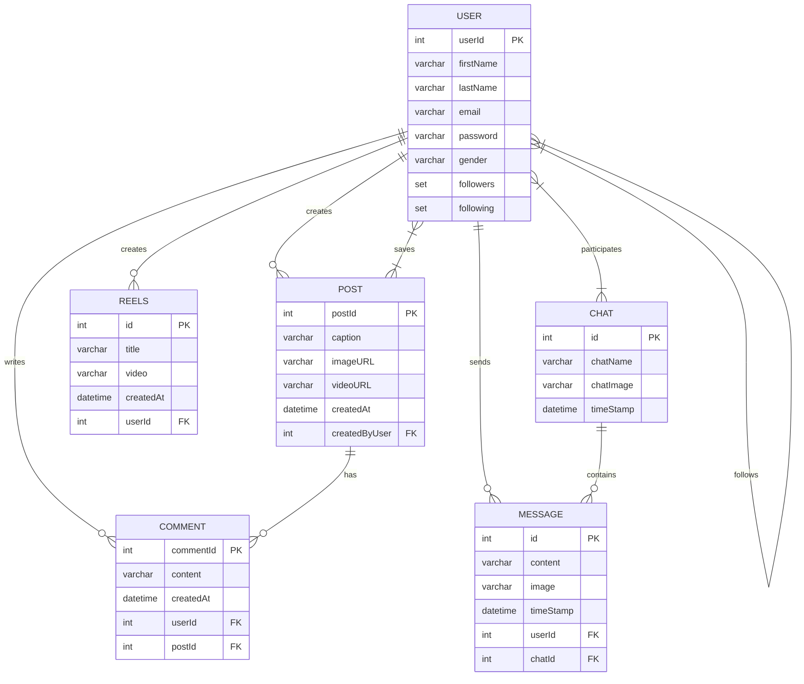

# 📱 Spring Social Media App — Backend API


> A robust, scalable RESTful backend for a Social Media Application built with **Java 17**, **Spring Boot 4.0.5**, and **PostgreSQL**.  
> Stateless JWT authentication, full DTO-based API (no entity leakage), input validation on all endpoints, and centralized exception handling.

---

## 📌 Overview

This application serves as the core backend engine for a social media platform:

- 👤 **User Management** — Registration, login, profile, follow/unfollow, search
- 📝 **Posts** — Create, like, save, delete with paginated feeds
- 💬 **Comments** — Nested commenting with likes
- 🎥 **Reels** — Short-form video feed
- 🗨️ **Chat & Messaging** — Direct chats with message history
- 🔐 **JWT Auth** — Stateless authentication on all `/api/**` routes
- ✅ **Validated Inputs** — `@Valid` enforced on all write endpoints
- 🛡️ **DTO Pattern** — Clean separation: raw JPA entities never exposed to clients

---

# 🛠 Tech Stack

| Layer       | Technology                                       |
| ----------- | ------------------------------------------------ |
| Language    | Java 17                                          |
| Framework   | Spring Boot 4.0.5                                |
| ORM         | Spring Data JPA (Hibernate)                      |
| Database    | PostgreSQL                                       |
| Security    | Spring Security + JJWT 0.12.5 (HS256, Stateless) |
| Validation  | `spring-boot-starter-validation`                 |
| Build       | Maven                                            |
| Boilerplate | Lombok                                           |
| Cache       | Spring Simple Cache (in-memory)                  |

---

# 🗄 Database Schema


```mermaid
erDiagram
    USER ||--o{ POST : creates
    USER ||--o{ COMMENT : writes
    USER ||--o{ REELS : creates
    USER }|--|{ CHAT : participates
    USER ||--o{ MESSAGE : sends
    POST ||--o{ COMMENT : has
    CHAT ||--o{ MESSAGE : contains
    USER }|--|{ POST : saves
    USER }|--|{ USER : follows

    USER {
        int userId PK
        varchar firstName
        varchar lastName
        varchar email
        varchar password
        varchar gender
        set followers
        set following
    }

    POST {
        int postId PK
        varchar caption
        varchar imageURL
        varchar videoURL
        datetime createdAt
        int createdByUser FK
    }

    COMMENT {
        int commentId PK
        varchar content
        datetime createdAt
        int userId FK
        int postId FK
    }

    REELS {
        int id PK
        varchar title
        varchar video
        datetime createdAt
        int userId FK
    }

    CHAT {
        int id PK
        varchar chatName
        varchar chatImage
        datetime timeStamp
    }

    MESSAGE {
        int id PK
        varchar content
        varchar image
        datetime timeStamp
        int userId FK
        int chatId FK
    }
```

---

## 📂 Project Structure

```
SpringSocialMediaApp/
├── pom.xml
├── README.md
├── reference.md               # Single source of truth for project context
└── src/main/java/com/dark/
    ├── configuration/         # Security (Appconfig), JWT (JwtProvider, jwtValidator), Cache
    ├── controller/            # 7 REST Controllers
    ├── Exceptions/            # Custom exceptions + GlobalException handler
    ├── mapper/                # DtoMapper — all entity → DTO conversions
    ├── model/                 # 6 JPA Entities (User, Post, Comment, Chat, Message, Reels)
    ├── repository/            # Spring Data JPA repositories with custom JPQL queries
    ├── request/               # Validated inbound DTOs (SignUpRequest, CreatePostRequest, etc.)
    ├── response/              # Outbound DTOs (UserDto, PostDto, ChatDto, etc.)
    └── service/               # Service interfaces + implementations per domain
```

---

# ⚙ Installation & Setup

## ✅ Prerequisites

- Java JDK 17+
- PostgreSQL 12+
- Maven 3+
- Any IDE (IntelliJ, Eclipse, VS Code)

---

## 🛠 Step 1: Create Database

```sql
CREATE DATABASE spcialmediaapp;
```

---

## 🔐 Step 2: Configure `application.properties`

```properties
spring.datasource.url=jdbc:postgresql://localhost:5432/spcialmediaapp
spring.datasource.username=YOUR_USERNAME
spring.datasource.password=YOUR_PASSWORD
spring.jpa.hibernate.ddl-auto=update
spring.datasource.driver-class-name=org.postgresql.Driver
spring.jpa.show-sql=true
spring.cache.type=simple
```

---

## ▶ Step 3: Run

```bash
./mvnw spring-boot:run
```

API accessible on `http://localhost:8080`

---

# 🔑 Authentication Flow

1. **Sign Up:** `POST /auth/signup` — returns JWT token
2. **Sign In:** `POST /auth/signin` — returns JWT token
3. For all other endpoints, pass the token in the header:

```
Authorization: Bearer <your_jwt_token>
```

All routes under `/api/**` are protected. Auth routes are public.

---

# 🌐 API Reference

### 👤 Auth

| Method | Endpoint       | Body            | Returns              |
| ------ | -------------- | --------------- | -------------------- |
| `POST` | `/auth/signup` | `SignUpRequest` | `AuthResponse` (201) |
| `POST` | `/auth/signin` | `SignInRequest` | `AuthResponse` (200) |

**SignUpRequest fields:** `firstName`\*, `lastName`, `gender`\*, `email`\*, `password`\* (min 6 chars)  
\* = required

---

### 👤 User

| Method   | Endpoint                             | Description            | Returns         |
| -------- | ------------------------------------ | ---------------------- | --------------- |
| `GET`    | `/api/users`                         | All users (paginated)  | `Page<UserDto>` |
| `GET`    | `/api/user/{id}`                     | Get user by ID         | `UserDto`       |
| `PUT`    | `/api/user`                          | Update own profile     | `UserDto`       |
| `GET`    | `/api/users/profile`                 | Own profile (from JWT) | `UserDto`       |
| `PUT`    | `/api/users/follow/{userId}`         | Follow a user          | `UserDto`       |
| `DELETE` | `/api/users/unfollow/{userId}`       | Unfollow a user        | `UserDto`       |
| `GET`    | `/api/user/search?query=`            | Search by name/email   | `Page<UserDto>` |
| `GET`    | `/api/user/{userId}/followers/count` | Follower count         | String          |
| `GET`    | `/api/user/{userId}/following/count` | Following count        | String          |

---

### 📝 Post

| Method   | Endpoint                      | Description                           | Returns         |
| -------- | ----------------------------- | ------------------------------------- | --------------- |
| `POST`   | `/api/post`                   | Create post                           | `PostDto` (201) |
| `GET`    | `/api/posts`                  | Own posts (from JWT)                  | `List<PostDto>` |
| `GET`    | `/api/allposts`               | Global feed (paginated, latest first) | `Page<PostDto>` |
| `PUT`    | `/api/post/likepost/{postId}` | Like/unlike a post                    | `PostDto`       |
| `PUT`    | `/api/post/savepost/{postId}` | Save/bookmark a post                  | `PostDto`       |
| `DELETE` | `/api/post/{postId}`          | Delete own post                       | `ApiResponse`   |

**CreatePostRequest fields:** `caption`\*, `imageURL`, `videoURL`

---

### 💬 Comment

| Method   | Endpoint                            | Description            | Returns            |
| -------- | ----------------------------------- | ---------------------- | ------------------ |
| `POST`   | `/api/commnet/create/{postId}`      | Add comment to post    | `CommentDto` (201) |
| `POST`   | `/api/like/{commentId}`             | Like a comment         | `CommentDto`       |
| `GET`    | `/api/comment/{commentId}`          | Get comment by ID      | `CommentDto`       |
| `GET`    | `/api/post/{postId}`                | All comments on a post | `List<CommentDto>` |
| `DELETE` | `/api/comment/{commentId}/{postId}` | Delete comment         | `ApiResponse`      |

**CreateCommentRequest fields:** `content`\*

> Note: The create comment URL has a known typo — `/commnet/` (not `/comment/`).

---

### 🎥 Reel

| Method | Endpoint              | Description                         | Returns         |
| ------ | --------------------- | ----------------------------------- | --------------- |
| `POST` | `/api/reel`           | Create a reel                       | `ReelDto` (201) |
| `GET`  | `/api/reels`          | All reels (paginated, latest first) | `Page<ReelDto>` |
| `GET`  | `/api/reels/{userId}` | Reels by a user                     | `List<ReelDto>` |

**CreateReelRequest fields:** `title`\*, `video`\*

---

### 🗨️ Chat & Message

| Method | Endpoint                       | Description                | Returns            |
| ------ | ------------------------------ | -------------------------- | ------------------ |
| `POST` | `/api/chats/create`            | Create a direct chat       | `ChatDto` (201)    |
| `GET`  | `/api/chats/{chatId}`          | Get chat by ID             | `ChatDto`          |
| `GET`  | `/api/chats/user/{userId}`     | All chats for current user | `List<ChatDto>`    |
| `POST` | `/api/message/create/{chatId}` | Send a message             | `MessageDto` (201) |
| `GET`  | `/api/message/chat/{chatId}`   | Message history            | `List<MessageDto>` |

**CreateMessageRequest fields:** `content`\*, `image`  
**CreatChatRequest fields:** `reciverId` (Integer)

---

# 🛡 Architecture Highlights

- **Stateless JWT Auth** — Token-based, no server sessions. JWT stores only `email` claim.
- **DTO Pattern** — `DtoMapper` class converts all JPA entities to safe outbound DTOs. No raw entities are ever returned from controllers.
- **Input Validation** — `@Valid` + Jakarta Validation annotations on all request bodies. Invalid payloads return `400` with field-level error messages.
- **Centralized Exception Handling** — `GlobalException` (@ControllerAdvice) maps all domain exceptions to `404`, validation errors to `400`, and unexpected errors to `500`.
- **LAZY Fetching** — All `@ManyToOne` relations use `FetchType.LAZY` to avoid N+1 queries.
- **Hibernate Proxy Safety** — `@JsonIgnoreProperties({"hibernateLazyInitializer", "handler"})` prevents serialization crashes.
- **Password Security** — BCrypt hashing; passwords annotated `@JsonProperty(WRITE_ONLY)` and never returned in responses.
- **Auto Cleanup** — Comments deleted automatically when parent post is deleted (`CascadeType.ALL` + `orphanRemoval = true`).
- **CORS** — Configured for `localhost:3000` and `localhost:5173`.

---

# 🚀 Roadmap

- [ ] WebSockets — Real-time chat using STOMP
- [ ] File Uploads — AWS S3 / Cloudinary (replacing plain-text URL strings)
- [ ] Role-Based Access Control — `ADMIN` / `USER` roles with `@PreAuthorize`
- [ ] Swagger / OpenAPI — Auto-generated API docs at `/swagger-ui.html`
- [ ] Frontend — React / Next.js client

---

⭐ If you like this project, give it a star on GitHub!
